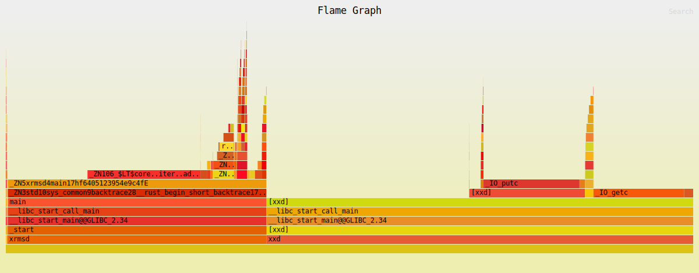
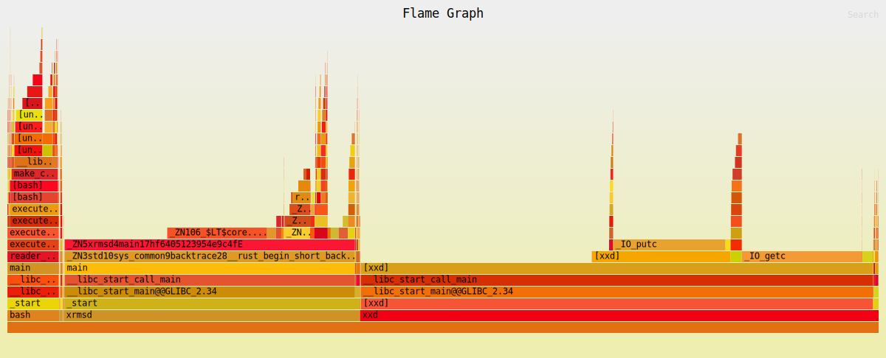
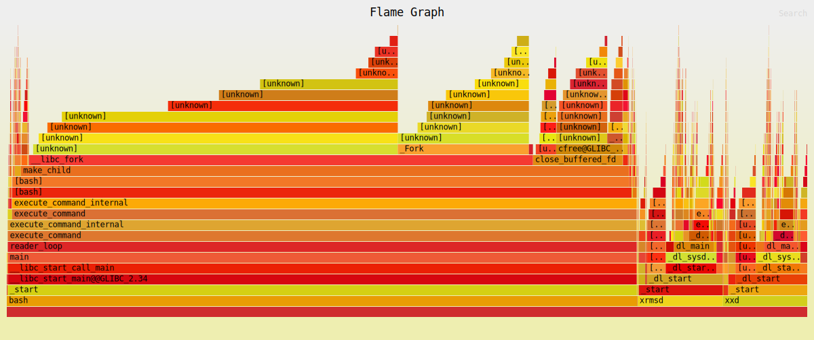

# XRSD

> Alpha

A small utility to convert data to hex and back.

Only works on stdin and stdout. Equivalent to 'xxd -p'.

Uses a 2kB buffer for writing. Faster for large files.

```
# Encode data into hex
$ xrsd -f <file > file.hex 
```
```
# Decode hex into data
$ xrsd -r <file.hex > file
```

## Imprecise Profiling
> tested with the name 'xrmsd'

Each graph contains the output of:
- `xrsd -f <file | xrsd -r > /dev/null`
- `xxd -p <file | xxd -p -r > /dev/null`

---

800mB file processed 5 times:



---

80mB file processed 50 times:



-- -

8KB file processed 5000 times:


